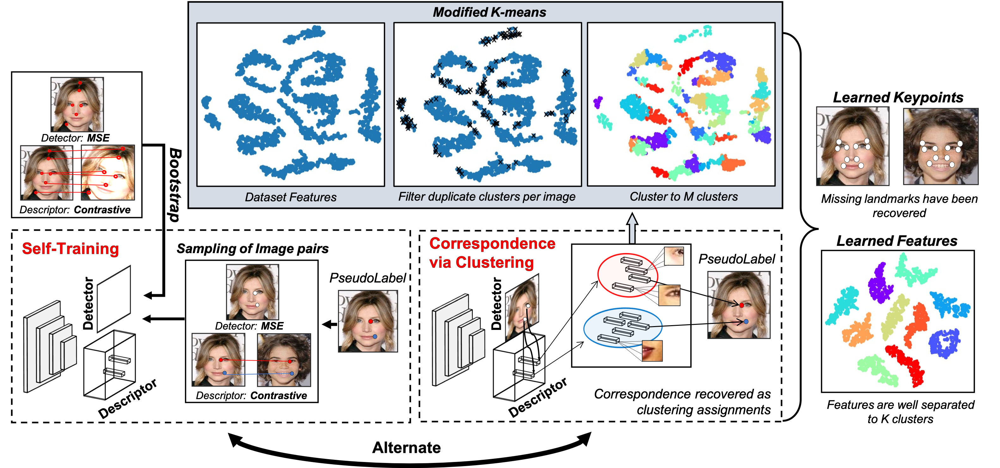

# From Keypoints to Object Landmarks via Self-Training Correspondence: A novel approach to Unsupervised Landmark Discovery
### Dimitrios Mallis, Enrique Sanchez, Matt Bell, Georgios Tzimiropoulos

This repository contains the training and evaluation code for paper ["From Keypoints to Object Landmarks via Self-Training Correspondence: A novel approach to Unsupervised Landmark Discovery"](https://arxiv.org/abs/2205.15895). This sofware learns a deep landmark detector, directly from raw images of a specific object category, without requiring any manual annotations.

#### _This work was accepted for publication in TPAMI. Early access [here](https://ieeexplore.ieee.org/document/10005822)!!_

#### _Dataloader and pretrained models for more databases will be released soon!!_




## Data Preparation


### CelebA

CelebA can be found [here](https://www.robots.ox.ac.uk/~vgg/research/unsupervised_landmarks/resources/celeba.zip). Download the .zip file inside an empty directory and unzip. We provide precomputed bounding boxes and 68-point annotations (for evaluation only) in _data/CelebA_.


## Installation

You require a reasonable CUDA capable GPU. This project was developed using Linux. 

Create a new conda environment and activate it:

```
conda create -n KeypToLandEnv python=3.8
conda activate KeypToLandEnv
```

Install [pythorch](https://pytorch.org/) and the [faiss library]((https://github.com/facebookresearch/faiss) ):

```
conda install pytorch torchvision cudatoolkit=10.2 -c pytorch
conda install -c pytorch faiss-gpu cudatoolkit=10.2
```

Install other external dependencies using pip and create the results directory.

```
pip install -r requirements.txt 
mkdir Results
```


Our method is bootstraped by Superpoint. Download weights for a pretrained Superpoint model from [here](https://github.com/magicleap/SuperPointPretrainedNetwork/blob/master/superpoint_v1.pth).

Before code execution you have to update `paths/main.yaml` so it includes all the required paths. Edit the following entries in `paths/main.yaml`.:

```
CelebA_datapath: <pathToCelebA_database>/celeb/Img/img_align_celeba_hq/
path_to_superpoint_checkpoint: <pathToSuperPointCheckPoint>/superpoint_v1.pth
```


## Testing

### Stage 1
To evaluate the first stage of the algorithm execute:

```
python eval.py --experiment_name <experiment_name> --dataset_name <dataset_name>  --K <K> --stage 1
```

The last checkpoint stored on ```_Results/\<experiment\_name\>/CheckPoints/_```  will be loaded automatically. TO you want to evaluate a particular checkpoint or pretrained model use the `path_to_checkpoint` argument.

### Stage 2

Similarly, to To evaluate the second stage of the algorithm execute:

```
python eval.py --experiment_name <experiment_name> --dataset_name <dataset_name>  --K <K> --stage 2
```

Cumulative forward and backward error curves will be stored in ```_Results/\<experiment\_name\>/Logs/_``` .


## Training


To execute the first step of our method please run:

```
python Train_Step1.py --dataset_name <dataset_name> --experiment_name <experiment_name> --K <K>
```

Similarly, to execute the second step please run:

```
python Train_Step2.py --dataset_name <dataset_name> --experiment_name <experiment_name> --K <K>
```

where _\< dataset\_name \>_ is in ``"CelebA"`` and _\< experiment\_name \>_ is a custom name you choose for each experiment. Please use the **same experiment name for both the first and second step**. The software will automatically initiate the second step with the groundtruth descovered in step one.


## Pretrained Models

We provide also pretrained models. Can be used to execute the testing script and produce visual results.

| Model       |K |Stage |Model        
| ---------|----- |:---:| --------------- |
| _CelebA_ | 10   |1 |   [link](https://drive.google.com/file/d/15Ez9YpgXWVf_-BjVICFdLoGkPjW5a5tV/view?usp=sharing) | 
| _CelebA_| 10 | 2 |   [link](https://drive.google.com/file/d/121NtZ_B8O1MwD25o5rLK0Ini_I8S12CY/view?usp=sharing) | 
| _CelebA_| 30   |1 |   [link](https://drive.google.com/file/d/1h3Z55uClTKwFAM0y1DF3jO56KOf7VzJ8/view?usp=share_link) | 
| _CelebA_| 30 | 2 |   [link](https://drive.google.com/file/d/11PazzSC1CWjQ-R8B-VZP-pTytv0IIZJh/view?usp=sharing) | |


## Citation
If you found this work useful consider citing:

```
@ARTICLE{10005822,
  author={Mallis, Dimitrios and Sanchez, Enrique and Bell, Matt and Tzimiropoulos, Georgios},
  journal={IEEE Transactions on Pattern Analysis and Machine Intelligence}, 
  title={From Keypoints to Object Landmarks via Self-Training Correspondence: A novel approach to Unsupervised Landmark Discovery}, 
  year={2023},
  volume={},
  number={},
  pages={1-15},
  doi={10.1109/TPAMI.2023.3234212}}
```
